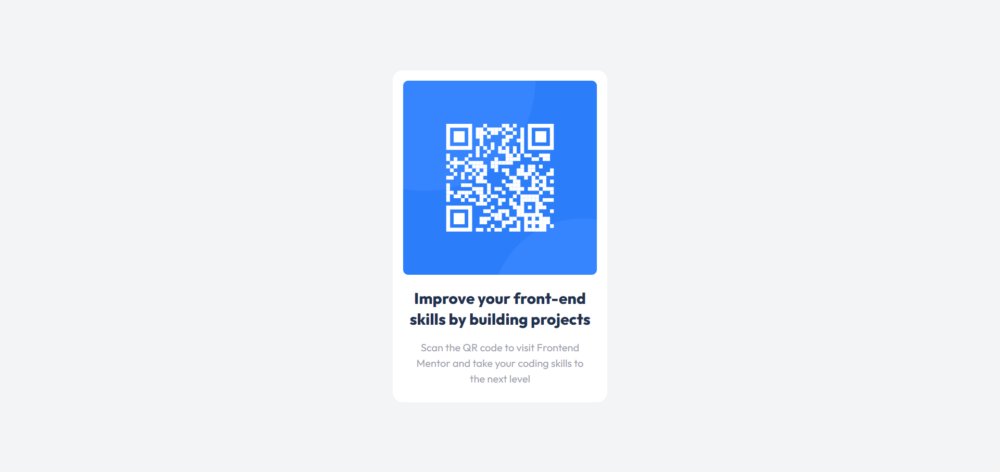

# Frontend Mentor - QR code component solution

This is a solution to the [QR code component challenge on Frontend Mentor](https://www.frontendmentor.io/challenges/qr-code-component-iux_sIO_H). Frontend Mentor challenges help you improve your coding skills by building realistic projects. 

## Table of contents

- [Overview](#overview)
  - [Screenshot](#screenshot)
  - [Links](#links)
- [My process](#my-process)
  - [Built with](#built-with)
  - [What I learned](#what-i-learned)
  - [Useful resources](#useful-resources)
- [Author](#author)
- [Project Acknowledgments](#project-acknowledgments)

## Overview

Create a single webpage with a QR code generator using HTML and traditional CSS.

### Screenshot

### Links

- Solution URL: [solution URL here](https://qrcode-component-olive-one.vercel.app/)
- Live Site URL: [live site URL here](https://qrcode-component-olive-one.vercel.app/)

## My process

### Built with

- Semantic HTML5 markup
- CSS custom properties
- Flexbox

### What I learned

Use this section to recap over some of your major learnings while working through this project. Writing these out and providing code samples of areas you want to highlight is a great way to reinforce your own knowledge.

- Semantic HTML5 markup
- CSS custom properties
- Box Model
- Flexbox Model

### Useful resources

- [Css flexbox resource 1](https://css-tricks.com/snippets/css/a-guide-to-flexbox) - This helped me for flexiblity of my webpage. I really liked this pattern and will use it going forward.

## Author

- Website - [Yogesh](https://portfolio-yogesh.dev)
- Frontend Mentor - [@yogesh-dev-stack](https://www.frontendmentor.io/profile/yogesh-dev-stack)
- Twitter - [@YOGESHISACTIVE](https://www.twitter.com/YOGESHISACTIVE)

## Project Acknowledgments

I would like to express my gratitude and acknowledge the contributions of my team mate Ayath in the development of this project. Ayath's dedication, expertise, and collaborative spirit have significantly enriched the project, making it a success.

### Team Collaboration

The success of this project is a result of effective teamwork and collaboration. Ayath's positive attitude and commitment to excellence played a key role in achieving our goals.

### Thank You, Ayath!

I extend a heartfelt thank you to Ayath for their hard work and dedication. Their efforts have been instrumental in the success of this project, and I look forward to future collaborations.
